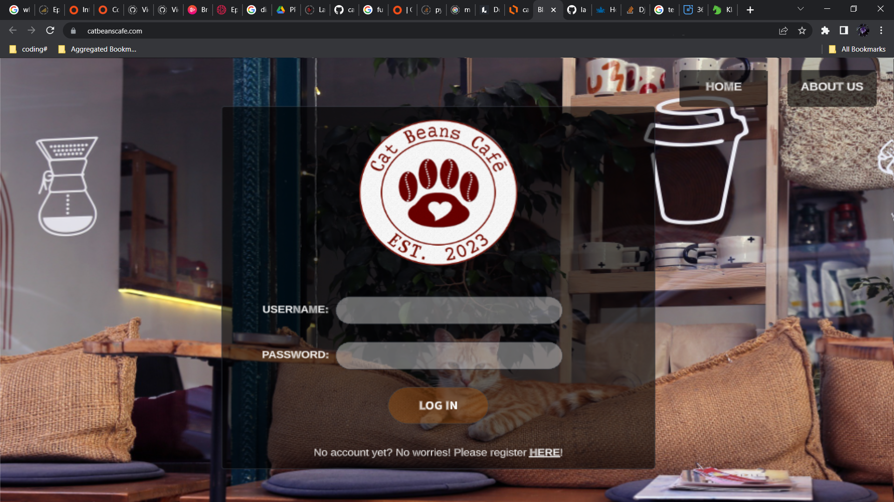

# Welcome to Cat Beans Café

## A café website.

> A cat themed, responsive café website with registration and table booking system for customers. Created as a fourth Project Portfolio for Code Institute.

#### - By Karolina Piech

---

## Table of contents 

 1. [ UX ](#ux)
 2. [ Agile Development ](#agile-development)
 3. [ Features implemented ](#features-implemented)  
 4. [ Features Left to Implement ](#features-left-to-implement)  
 5. [ Technology used ](#technology-used) 
 6. [ Testing ](#testing)  
 7. [ Bugs ](#known-bugs)  
 8. [ Deployment](#deployment)
 9. [ Resources ](#resources)  
 10. [ Credits and acknowledgements ](#credits-and-acknowledgements)

---

# UX

<a name="ux"></a>

## Database planning 

#### Data structure


- After deciding on the kind of the project and features I wanted to implement I used a lucidchart to plan the database structure.
- The above diagram is serving as an initial guide to indicate the types and relationships between data stored.

#### Data models

> Customer model

- The revised data models developed as the project evolved into it's current state:

| Key | Name | Field |
|--|--|--|
| PrimaryKey | user_id | OnetoOneField  |
| x | first_name | Charfield |
| x | last_name | Charfield |
| x | email | EmailField |
| x |contact_phone | Charfield |

---

> Bookings model

| Key | Name | Field |
|--|--|--|
| ForeignKey | booking_customer | ManytoOneField  |
| x | booking_date | DateField |
| x | booking_time | TimeField |
| ForeignKey | tables_booked | IntegerField |
| x | additional_info  | TextField |
| x | is_confirmed | IntegerField |

---

## UX design


### Overview

#### Design

> Initial design planning

Early design stage of this project included making png versions of a homepage and login page prototypes.
Thanks to that I could decide on the aesthetic choices before entering the coding stage.




I wanted the website to look modern, professional and welcoming. I chose the base colours to be in the shades of brown, black and white, as they may be associated with coffee.

#### Site User

- Someone over 16 years old from the café's area
- A cat loving person looking for the place to relax
- Someone who prefers to arrange their bookings digitally rather than over the phone or in person

#### Goals for the website

- To allow customers to see the menu before visiting the café
- To allow customers to plan their booking in advance
- To safely store the bookings data and make it available for designated staff to approve or decline it in an easy way

### Wireframes

The next stage of UX design planning was creating the basic wireframes using [Figma](https://www.figma.com/).
My intention was to create visually pleasing and easy to navigate website. Below I did not include the base homepage and login page, as I used the initial planning examples from above instead.

> Large to medium screens


> Small screens


##### [ Back to Top ](#table-of-contents)

---

# Agile Development

## Overview

I started this project alongside GitHub Projects with intention of planning and tracking the workflow to manage the expected workload. After setting out the epics for my project I broke them down into a set of user stories and smaller tasks, to help me monitor my progress and finish the website in time. Outside of user stories I also included a separate issues for creating each module of this README file, as I simply found it more motivating this way. To see the project's Kanban page please click [here](https://github.com/users/TulaUnogi/projects/3/views/1).

## User Stories

Initial stage of the project included stepping into the shoes of the future User. I thought about the features and functionality I would expect from the first use of the website and based on that I created a set of 12 User Stories. I labelled 10 of them as mandatory, as they provide the core functionality and source of important informations for the User. The remaining 2 Stories are labelled as NINTH- Nice To Have, Not Important, as they provide some improvements, but are not necessary for the User to enjoy the website's base functionality. 

The User Stories include the acceptance criteria and are broken down into smaller, bite- size tasks that I would tick on completion, so I could easily track my progress. During the coding session I would record the encountered bugs, issues and solutions related to the Story in the comments below. Once all of the tasks in the Issue are completed I would move the User Story form "In progress" to "Completed" card im my project's Kanban.

> List of Mandatory User Stories

1. [USER STORY: DEPLOYMENT](https://github.com/TulaUnogi/cat-beans-cafe/issues/16)
2. [USER STORY: ADMIN PANEL](https://github.com/TulaUnogi/cat-beans-cafe/issues/17)
3. [USER STORY: CREATE AN ACCOUNT](https://github.com/TulaUnogi/cat-beans-cafe/issues/18)
4. [USER STORY: EDITING PROFILE](https://github.com/TulaUnogi/cat-beans-cafe/issues/22)
5. [USER STORY: DELETING PROFILE](https://github.com/TulaUnogi/cat-beans-cafe/issues/23)
6. [USER STORY: TABLE BOOKING](https://github.com/TulaUnogi/cat-beans-cafe/issues/21)
7. [USER STORY: NAVBAR AND FOOTER](https://github.com/TulaUnogi/cat-beans-cafe/issues/20)
8. [USER STORY: ABOUT US](https://github.com/TulaUnogi/cat-beans-cafe/issues/19)
9. [USER STORY: MENU](https://github.com/TulaUnogi/cat-beans-cafe/issues/26)
10. [USER STORY: GOOGLE MAPS](https://github.com/TulaUnogi/cat-beans-cafe/issues/25)

> NINTH: Not Important, Nice To Have

11. [USER STORY: CAT CAROUSEL](https://github.com/TulaUnogi/cat-beans-cafe/issues/24)
12. [USER STORY: BOOKING CANCELLATION](https://github.com/TulaUnogi/cat-beans-cafe/issues/27)

##### [ Back to Top ](#table-of-contents)

---

# Features implemented

##### [ Back to Top ](#table-of-contents)

---

# Features Left to Implement

##### [ Back to Top ](#table-of-contents)

---

# Technology used 

##### [ Back to Top ](#table-of-contents)

---

# Testing

##### [ Back to Top ](#table-of-contents)

---
 
# Known bugs 

##### [ Back to Top ](#table-of-contents)

---

# Deployment

#### The deployment stage of the website should follow the steps below:

> Create the Heroku app

- Sign up / Log in to Heroku
- In Heroku Dashboard page select 'New' and then 'Create New App'
- Name a project - I decided on the Cat Beans Café (the app's name must be unique)
- Select EU as that was my region in the moment of creating the app
- Select "Create App"
- In the "Deploy" tab choose GitHub as the deployment method
- Connect your GitHub account/ find and connect your GitHub repository

> Set up enviroment variables

- In the Django app editor create env.py in the top level
- In env.py import os
- In env.py set up necessary enviroment variables:
  - add a secret key using: os.environ['SECRET_KEY'] = 'your secret key'
  - for the database variable the line should include os.environ['DATABASE_URL']= 'Paste the database link in here'
  - in settings.py replace value of SECRET_KEY variable with os.environ.get('SECRET_KEY')
  - in settings.py change the value of DATABASES variable to 'default': dj_database_url.parse(os.environ.get("DATABASE_URL"))
- In Django app's settings.py on top of the file add:
```
from pathlib import Path
import os
import dj_database_url
if os.path.isfile('env.py'):
    import env
```
- Navigate to the "Settings" tab in Heroku.
- Open the "Config Vars" section and add DATABASE_URL as Key and the database link from app's env.py as Value
- Add SECRET_KEY for the Key value and the secret key value from env.py as the Value
- In the terminal migrate the models over to the new database connection
- In settings.py add the STATIC files settings as follows:
```
STATIC_URL = '/static/'
STATICFILES_DIRS = [os.path.join(BASE_DIR, 'static')]
STATIC_ROOT = os.path.join(BASE_DIR, "staticfiles")
```
- Change the templates directory in settings.py to: TEMPLARES_DIR = os.path.join(BASE_DIR, 'templates')
- In TEMPLATES variable change the 'DIRS' key to look like this: 'DIRS': [TEMPLARES_DIR],
- Add Heroku to the ALLOWED_HOSTS list (the format will be your-app-name.herokuapp.com, you can copy it from the Domains section in Settings tab in your Heroku app)
- If you haven't done that up to this point, then create in your Django app's code editor new top level folders: static and templates
- Create a new file on the top level directory - Procfile, remembering to use a capital letter
- Within the Procfile add following:
```
web: guincorn PROJECT_NAME.wsgi
``` 
- In the terminal, add the changed files, commit and push to GitHub

> Heroku deployment

- In Heroku, navigate to the Deployment tab and deploy the branch manually 
- Heroku will display a build log- watch the build logs for any errors
- Once the build process is completed Heroku displays 'Your App Was Successfully Deployed' message and a link to the app to visit the live site
- As my first 2 build attempts failed I needed to apply changes to my code (I forgot to set up the static files and templates) to successfully deploy on the 3rd time 

#### Forking the repository

By forking the GitHub Repository you can make a copy of the original repository to view or change without it effecting the original repository. You can do this with following steps:

- Log in to GitHub or create an account
- Enter this [repository link](https://github.com/TulaUnogi/cat-beans-cafe)
- Select "Fork" from the top of the repository
- A copy of the repository should now be created in your own repository

#### Create a clone of this repository

Creating a clone enables you to make a copy of the current version of this repository to run the project locally. To do this follow steps below:

- Navigate to https://github.com/TulaUnogi/cat-beans-cafe
- Click on the <>Code button at the top of the list of files
- Select the "HTTPS" option on the "Local" tab and copy the URL it provides to the clipboard
- Navigate to your code editor and in the terminal change the directory to your chosen location 
- Type "git clone" and paste the GitHub repository's link
- Press enter and git will clone the repository for you

##### [ Back to Top ](#table-of-contents)

---

# Resources

##### [ Back to Top ](#table-of-contents)

---

# Credits and acknowledgements

> Code

- <b>Roger Pfäffli</b>, Code Institute Alumnus for explaining on Slack how to set up development and DEBUG variables in env.py
- <b>[Coding Yaar](https://codingyaar.com/shorts/bootstrap-navbar-toggler-color-change/)</b> for Bootstrap navbar toggler colour change tutorial


##### [ Back to Top ](#table-of-contents)
