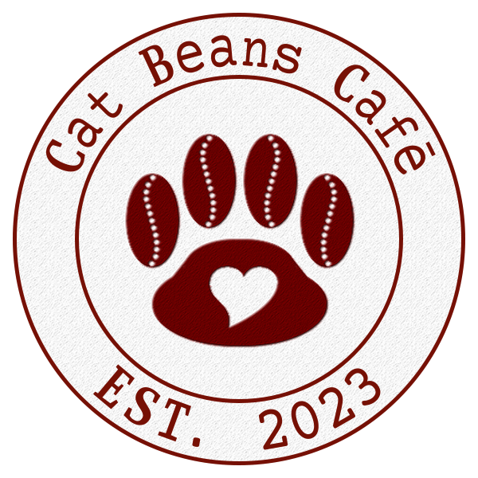

# Welcome to Cat Beans Café

## A café website.

> A cat themed, responsive café website with registration and table booking system for customers. Created as a fourth Project Portfolio for Code Institute.

#### - By Karolina Piech

---

## Table of contents 

 1. [ UX ](#ux)
 2. [ Agile Development ](#agile-development)
 3. [ Features implemented ](#features-implemented)  
 4. [ Features Left to Implement ](#features-left-to-implement)  
 5. [ Technology used ](#technology-used) 
 6. [ Testing ](#testing)  
 7. [ Bugs ](#known-bugs)  
 8. [ Deployment](#deployment)
 9. [ Resources ](#resources)  
 10. [ Credits and acknowledgements ](#credits-and-acknowledgements)

---

# UX

## Database planning 

#### Data structure

- After deciding on the kind of the project and features I wanted to implement I used a lucidchart to plan the database structure.
- The above diagram is serving as an initial guide to indicate the types and relationships between data stored.

#### Data models

> Customer model

| Key | Name | Field |
|--|--|--|
| PrimaryKey | user_id | OnetoOneField  |
| x | first_name | Charfield |
| x | last_name | Charfield |
| x | email | EmailField |
| x |contact_phone | Charfield |
| ForeignKey | user_bookings | ManytoOneField |

---

> Bookings model

| Key | Name | Field |
|--|--|--|
| ForeignKey | booking_id | ManytoOneField  |
| x | booking_date | DateField |
| x | booking_time | TimeField |
| ForeignKey | tables_booked | ManytoOneField |
| x | additional_info  | Textarea |
| x | is_confirmed | Boolean |
| ForeignKey | customer | ManytoOneField |

---

## UX design

### Overview

#### Design

> Initial design planning

Early design stage of this project included making png versions of a homepage and login page prototypes.
Thanks to that I could decide on the aesthetic choices before entering the coding stage.

#### Site User

#### Goals for the website

### Wireframes

##### [ Back to Top ](#table-of-contents)

---

# Agile Development

## Overwiev

## User Stories

##### [ Back to Top ](#table-of-contents)

---

# Features implemented

##### [ Back to Top ](#table-of-contents)

---

# Features Left to Implement

##### [ Back to Top ](#table-of-contents)

---

# Technology used 

##### [ Back to Top ](#table-of-contents)

---

# Testing

##### [ Back to Top ](#table-of-contents)

---
 
# Known bugs 

##### [ Back to Top ](#table-of-contents)

---

# Deployment

##### [ Back to Top ](#table-of-contents)

---

# Resources

##### [ Back to Top ](#table-of-contents)

---

# Credits and acknowledgements

##### [ Back to Top ](#table-of-contents)
